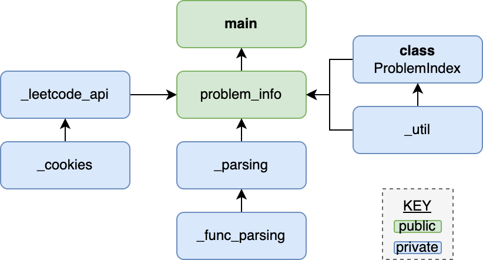

.. rossmassey.fetch-leetcode-problem documentation master file, created by
   sphinx-quickstart on Mon Jan 29 19:25:41 2024.

*********************************
rossmassey.fetch-leetcode-problem
*********************************

.. _package: https://pypi.org/project/rossmassey.fetch-leetcode-problem/

This `package`_ will fetch problem info and synced code for a leetcode problem

To install:

.. code-block:: bash

   pip install rossmassey.fetch-leetcode-problem

To use (*note: output won't be formatted*):

.. code-block:: python

      >>> import fetch_leetcode_problem as lc

      >>> lc.update_problem_listing()
      >>> info = lc.get_problem(1)
      >>> print(info)
      {'num': '1',
       'title': 'Two Sum',
       'slug': 'two-sum',
       'difficulty': 'Easy',
       'description': 'Given an array of integers ``nums``\xa0and an integer ``target``, return *indices of the two numbers such that they add up to ``target``*.\n\nYou may assume that each input would have ***exactly* one solution**, and you may not use the *same* element twice.\n\nYou can return the answer in any order.\n\n',
       'examples': [{'input': 'nums = [2,7,11,15], target = 9',
        'output': '[0,1]',
        'img': None,
        'explanation': ' Because nums[0] + nums[1] == 9, we return [0, 1].\n'},
       {'input': 'nums = [3,2,4], target = 6',
        'output': '[1,2]',
        'img': None,
        'explanation': None},
       {'input': 'nums = [3,3], target = 6',
        'output': '[0,1]',
        'img': None,
        'explanation': None}],
       'constraints': ['``2 <= nums.length <= 10^4``',
       '``-10^9 <= nums[i] <= 10^9``',
       '``-10^9 <= target <= 10^9``',
       '**Only one valid answer exists.**'],
       'code_snippet': 'class Solution:\n    def twoSum(self, nums: List[int], target: int) -> List[int]:\n        ',
       'code': 'class Solution:\n    def twoSum(self, nums: List[int], target: int) -> List[int]:\n        \n        complements = {}\n        \n        for i, num in enumerate(nums):\n            complements[num] = i\n            \n        for i, num in enumerate(nums):\n            if (target - num) in complements and complements[target-num] != i:\n                return [i, complements[target-num]]',
       'func': {'name': 'twoSum',
       'params': ['self', 'nums', 'target'],
       'param_types': [None, 'List[int]', 'int'],
       'rtype': 'List[int]'}}

Alternatively:

.. code-block:: bash

   python -m fetch_leetcode_problem.main 1

* **u:** update the problem index
* **c:** count number of problems
* `<num>`: get problem info for `<num>`

See :doc:`cookies` for information on how to get synced user code

See :doc:`database` for information on the sqlite3 database and API requests

Articles
-------------

.. toctree::
   :maxdepth: 1

   cookies
   database

Documentation
-------------

.. toctree::
   :maxdepth: 2

   GitHub Repo <https://github.com/rossmassey/fetch-leetcode-problem>
   public
   private

Modules
-------

* :ref:`modindex`
